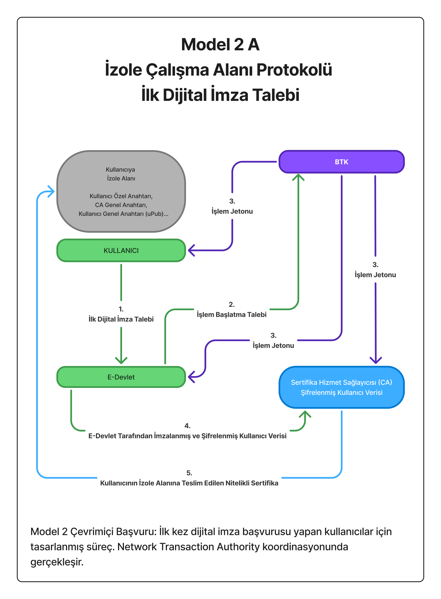
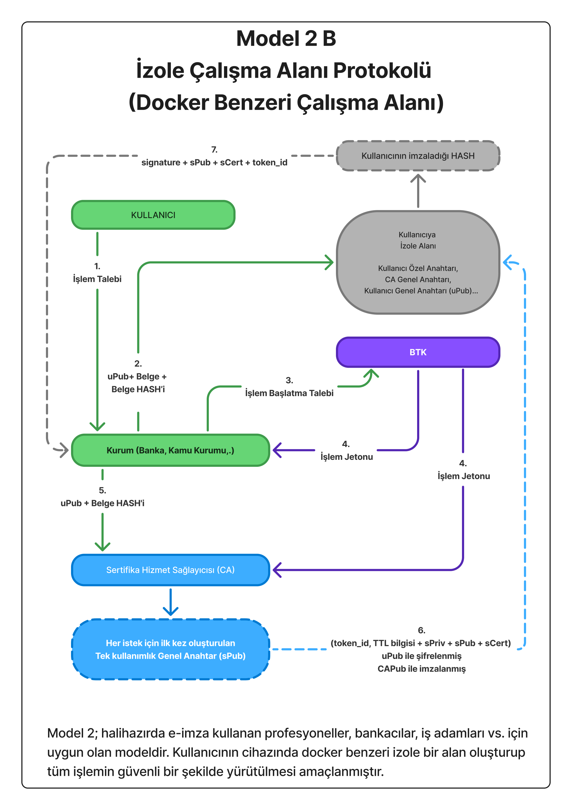
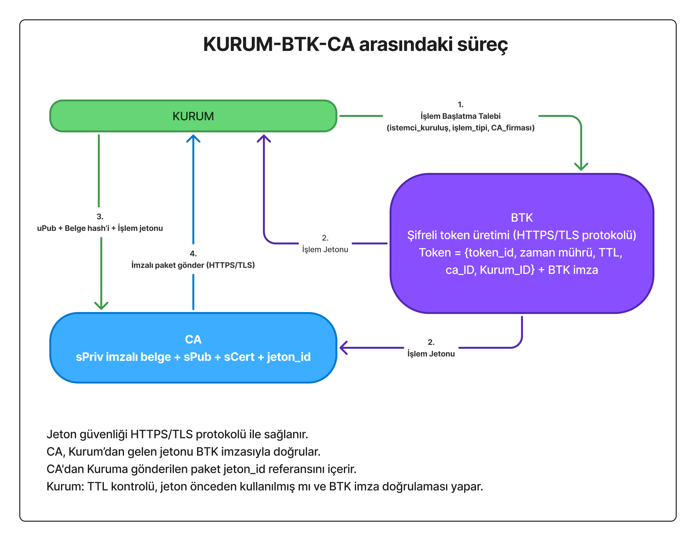
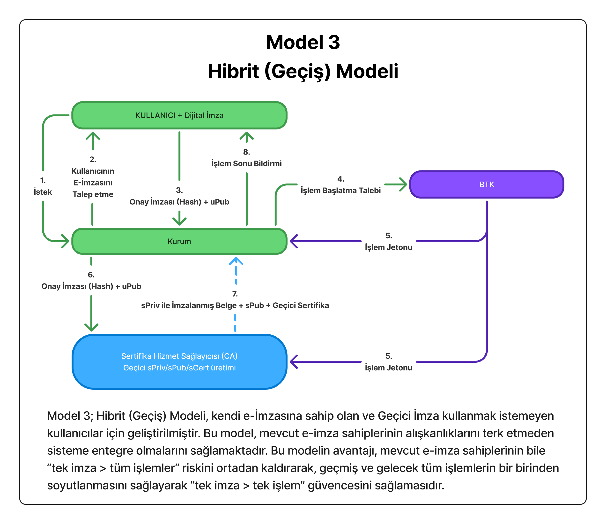

# Tek Kullanımlık E-İmza Protokolü (TKEP)

**Her işlem için yeni anahtar, sıfır donanım maliyeti, tam güvenlik.**

---

Tek Kullanımlık E-İmza Protokolü (TKEP), e-imza teknolojisinde devrim niteliğinde yeni bir protokol önermektedir. Bu sistem, Türkiye'yi dijital imza alanında takip eden değil takip edilen ülke konumuna taşıyabilecek, dünyada henüz hiçbir ülkede uygulanmayan benzersiz bir yaklaşımdır.

### Mevcut Sistemin Sorunları

Bugün Türkiye'de e-imza kullanım oranı %5'in altındadır. Klasik e-imza protokolünde CA firmalarından alınan dijital imzalar, 3 yıl geçerli olmak üzere kullanıcıya teslim edilen özel cihazlarda (akıllı kart, USB token) barındırılmak zorundadır. Bu durum ciddi sorunlar yaratmaktadır:

**Güvenlik Riski:** E-imza cihazlarının çalınması veya kaybolması halinde, dijital imza sahibinin önceki ve sonraki tüm resmi işlemleri tehlikeye girebilmektedir. Tek bir güvenlik ihlali, yıllarca süren işlem geçmişini ve geleceğini riske atabilir.
**Sürekli Taşıma Zorluluğu:** Dijital imza sahipleri cihazlarını yanlarından ayıramaz. Yanında taşımasa işlem yapamaz, yanında taşısa güvenlik riski doğar.
**Ekonomik Engeller:** Donanım maliyetleri (500–1500 TL) ve karmaşık süreçler nedeniyle vatandaşlar e-imza kullanmaktan uzak durmaktadır.
**Teknolojik Kilitlenme:** Donanım bazlı sistemlerde kriptografik algoritma güncellemeleri için tüm cihazların toplanıp değiştirilmesi gerekir. Bu, milyarlarca TL maliyet ve yıllarca süren geçiş dönemi demektir.

### Paradigma Değişimi: Tek Kullanımlık Anahtarlar

Tek Kullanımlık E-İmza Protokolü'nin kırılma noktası şu yaklaşımdır:
**"Her işlem için yeni, tek kullanımlık anahtarlar üretilir."**

Bu devrimsel paradigma ile:

* Kullanıcı fiziksel cihaz taşımak zorunda değildir.
* Her işlem için yeni sPriv/sPub/sCert üretilir.
* Bir işlemin güvenlik ihlali diğer işlemleri etkilemez.
* Cep telefonu ile saniyeler içinde güvenli imzalama mümkündür.

Sistem iki farklı modelle çalışabilir:

**Model 2B (İzole Alan):** Kullanıcı cihazında güvenli bir izole alan oluşturulur. CA her işlem için tek kullanımlık anahtar çifti (sPriv/sPub) üretir ve şifreli olarak kullanıcıya gönderir. Kullanıcı kendi cihazında HASH'i imzalar ve kuruma iletir.

**Model 3 (Hibrit - Geçiş):** Mevcut e-imza sahipleri için geçiş modeli. Kullanıcı USB token'ı ile işleme onay verir. CA bu onayı doğrular, kullanıcının kimliğini tasdik eder, sPriv/sPub üretir ve belgeyi imzalar. Bu yapı, noterlik sistemine benzer şekilde iki aşamalı doğrulama sağlar.

Her iki modelde de tek kullanımlık anahtarlar sayesinde bir işlemin güvenlik ihlali diğer işlemleri etkilemez.

---

### 🔐 Kriptografik Primitifler

| Kullanım Amacı | Önerilen Algoritma | Standart |
|---|---|---|
| İmzalama (kullanıcı) | Ed25519 veya Dilithium3 | RFC 8032 / FIPS 204 |
| İmzalama (CA/BTK) | Ed25519 veya Dilithium3 | RFC 8032 / FIPS 204 |
| Şifreleme (KEM) | X25519 + HKDF + AES-256-GCM | RFC 7748 / RFC 5869 |
| Hash | SHA-3-256 | FIPS 202 |

> **Kuantum direnci:** Mevcut dağıtımda Ed25519 yeterlidir; kuantum tehdidi belirginleştiğinde Dilithium3'e geçiş donanım değişimi gerektirmez — yalnızca yazılım güncellemesi yeterlidir.

---

### 🌟 Amaç ve Vizyon

> **Tek Kullanımlık E-İmza (Single-Use Digital Signature)** modeli, Türkiye'de e-İmza altyapısını mobil, güvenli ve yaygın hale getirmeyi amaçlar.
>
> Her işlemde yeni bir **(sPriv, sPub, sCert)** anahtar çifti oluşurulur.
> İşlem tamamlandığında **sPriv kalıcı olarak imha edilir.**

**Avantajlar:**

* 🔐  Zincirleme risk sıfır: Geçmiş ve gelecek işlemler etkilenmez.
* 📱  Donanım gerektirmez: Vatandaş telefondan saniyeler içinde onay verir.
* 🛠️  Mevcut altyapıyla uyumlu: CA, BTK, Kurum rolleri değişmez.
* 🌎  5070 sayılı Kanun ve eIDAS ile tam uyum.

---

## 🔹 Model 2A – İlk Dijital İmza Talebi (Başvuru Süreci)

**Akış:** Kullanıcı e-Devlet ile kimlik doğrular, CA tarafından kullanıcıya özel sertifika (şifreli) üretilir ve izole alan oluşturulur.

> *Model 2A*, ilk dijital imza talebinde bulunan kullanıcılar için tasarlanmıştır. BTK koordinasyonunda CA ile doğrulama yapılır.

---

## 🔹 Model 2B – İzole Çalışma Alanı (Docker Benzeri Yapı)

**Akış:** Her işlem için yeni bir izole alan oluşurulur.
CA, bu işleme özel sPriv/sPub/sCert setini şifreli olarak kullanıcıya aktarır.
Belge HASH'i bu tek kullanımlık anahtarla imzalanır.

> *Model 2B*, profesyoneller (bankacı, hukukçu, kamu yetkilisi vb.) için geliştirilmiştir. Docker-benzeri izole ortamda işlem güvenliği maksimumdadir.

---

## 🔹 Kurum-BTK-CA Arasındaki Süreç

**Akış:**

1. Kurum işlem başlatır.
2. BTK, şifreli token (TTL, imza, jeton_id) üretir.
3. CA bu tokenı kullanarak sertifika üretir.
4. Kurum, BTK imzasını ve tokenı doğrular.

> BTK sadece koordinatör ve imzalayıcıdır; veri içeriğine erişmez.

---

## 🔹 Model 3 – Hibrit (Geçiş) Modeli

**Akış:** Klasik e-İmza sahipleri için tasarlanmıştır.
Kullanıcı klasik imzasıyla onay verir, CA ikinci bir tasdik imzası atar.

> *Model 3*, mevcut altyapıdan kopmadan, yeni sisteme geçiş için köprü görevindedir.

---

## 🔹 Sonuç: Yeni Nesil E-İmza Ekosistemi

> Bu mimari, sadece bugünün değil **kuantum sonrası çağın da temelini** oluşturur.

* Donanım değişmeden algoritma güncellenebilir.
* Vatandaş için kolay, kurumlar için denetlenebilir bir modeldir.
* Devlet için operasyonel maliyetleri minimize eder.

---

## 📓 Daha Fazla Bilgi

Teknik detaylar, şifreleme yapıları, zaman damgası akışları ve NIST test sonuçları için:

➡️ [README_long.md](README_long.md)

---

---

---

## ⚠️ Bilinen Sınırlamalar ve İyileştirme Yönergeleri (v1.1)

| # | Sınırlama | Etki | Çözüm Yönü |
|---|-----------|------|------------|
| 1 | **CA sPriv'i biliyor** — CA imza anahtarını ürettiği için teorik olarak kullanıcı adına imza atabilir. İnkar edilemezlik (non-repudiation) zayıftır. | Hukuki geçerlilik | Kullanıcı kendi geçici anahtarını TEE'de üretsin, CA sadece doğrulasın ([GKDP](https://github.com/guvenacar/GKDP-Guvenli-Kimlik-Dogrulama-Protokolu) / [EIDA](https://github.com/guvenacar/EIDA) modeli) |
| 2 | **Yazılımsal izolasyon** — Docker-benzeri izole alan donanımsal değildir. Kernel açığı uPriv'i açığa çıkarabilir. | Yüksek riskli işlemler | 3 seviyeli model: Seviye 1 (ARM TrustZone), Seviye 2 (TPM 2.0), Seviye 3 (yazılım — sadece test) |
| 3 | **BTK durumlu** — Her jeton veritabanına yazılır, ölçeklenebilirlik sınırlıdır. | Uzun vadeli maliyet | Jeton TTL sonrası temizlenebilir; büyük ölçekte EIDA'nın stateless CA modeli değerlendirilebilir |
| 4 | **CA korelasyonu** — CA her işlemde uPub'ı görür, tüm işlemleri tek kimliğe bağlayabilir. | Kullanıcı gizliliği | Kabul edilmiş risk (CA güvenilir taraftır); ileri seviyede ePub katmanı eklenebilir |
| 5 | **Kuantum direnci** — Mevcut dokümanda belirtilmemişti. | Gelecek tehdidi | ✅ Yukarıdaki primitifler tablosu ile çözüldü |

> **Not:** Bu sınırlamalar protokolü kullanılamaz kılmaz. Her biri bilinçli bir tasarım kararı veya aşamalı iyileştirme planının parçasıdır. Detaylı analiz için [README_long.md](README_long.md) Bölüm 7'ye bakınız.

---

## Yapay Zekaların TKEP hakkındaki Görüşleri

➡️ [chatGPT'nin yorumu:](chatGPT_yorumu.md)  
➡️ [Claude'ın yorumu:](claude_yorumu.md)  
➡️ [DeepSeek'in yorumu:](deepseek_yorumu.md)  

---

**Proje Sahibi:** [@guvenacar](https://github.com/guvenacar)
**Repo:** [guvenacar/e-imza-protokolu](https://github.com/guvenacar/e-imza-protokolu)

---

> “Doğru mimari varsa, algoritma değişir ama güvenlik kalır.”
> — Güven Acar
